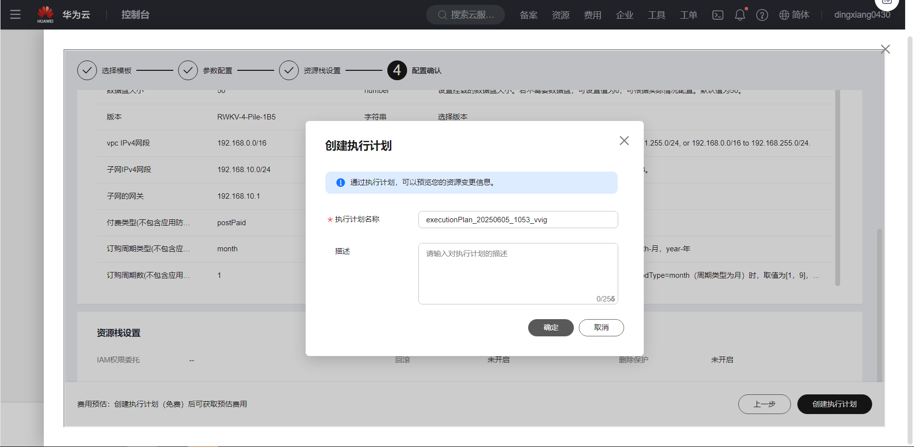

# doris数据库使用指南

# 一、商品链接

[doris数据库]()

# 二、商品说明

**Apache Doris** 是一款基于 MPP 架构的高性能、实时的分析型数据库，以高效、简单、统一的特点被人们所熟知，仅需亚秒级响应时间即可返回海量数据下的查询结果，不仅可以支持高并发的点查询场景，也能支持高吞吐的复杂分析场景。基于此，Apache Doris 能够较好的满足报表分析、即席查询、统一数仓构建、湖仓一体等使用场景，用户可以在此之上构建大屏看板、用户行为分析、AB 实验平台、日志检索分析、用户画像分析、订单分析等应用。

# 三、商品购买

您可以在云商店搜索 **Trino分布式SQL查询工具**。

其中，地域、规格、推荐配置使用默认，购买方式根据您的需求选择按需/按月/按年，短期使用推荐按需，长期使用推荐按月/按年，确认配置后点击“立即购买”。


## 3.1 使用 RFS 模板直接部署

必填项填写后，点击 下一步


创建直接计划后，点击 确定


点击部署，执行计划

如下图“Apply required resource success. ”即为资源创建完成

# 3.2ECS 控制台配置

### 准备工作

在使用ECS控制台配置前，需要您提前配置好 **安全组规则**。

> **安全组规则的配置如下：**
> - 入方向规则放通端口8030，源地址内必须包含您的客户端ip，否则无法访问
> - 入方向规则放通端口8040，源地址内必须包含您的客户端ip，否则无法访问
> - 入方向规则放通 CloudShell 连接实例使用的端口 `22`，以便在控制台登录调试
> - 出方向规则一键放通

### 创建ECS

前提工作准备好后，选择 ECS 控制台配置跳转到[购买ECS](https://support.huaweicloud.com/qs-ecs/ecs_01_0103.html) 页面，ECS 资源的配置如下图所示：

选择CPU架构

选择服务器规格

选择镜像

其他参数根据实际请客进行填写，填写完成之后，点击立即购买即可


> **值得注意的是：**
- VPC 您可以自行创建
- 安全组选择 [**准备工作**](#准备工作) 中配置的安全组；
- 弹性公网IP选择现在购买，推荐选择“按流量计费”，带宽大小可设置为5Mbit/s；
- 高级配置需要在高级选项支持注入自定义数据，所以登录凭证不能选择“密码”，选择创建后设置；
- 其余默认或按规则填写即可。

## 商品使用


### 查看服务是否启动
登录上服务器，通过【jps】查看服务是否启动，正常启动会显示 DorisBE
和 DorisFE信息


如果服务没有启动，可以手动启动，启动命令
```bash
/opt/doris-2.1.10/fe/bin/start_fe.sh --daemon
/opt/doris-2.1.10/be/bin/start_be.sh --daemon
```

### 访问UI
通过IP+8030访问UI 用户名root,密码doris


### 建库建表
使用 root 账户连接 Apache Doris FE。
```bash
mysql -uroot -P9030 -h127.0.0.1
```

创建数据库和数据表
```sql
create database demo;
use demo;
create table mytable
(
k1 TINYINT,
k2 DECIMAL(10, 2) DEFAULT "10.05",    
k3 CHAR(10) COMMENT "string column",    
k4 INT NOT NULL DEFAULT "1" COMMENT "int column"
)
COMMENT "my first table"
DISTRIBUTED BY HASH(k1) BUCKETS 1
PROPERTIES ('replication_num' = '1');
```


### 导入数据
将以下示例数据，保存在本地的 data.csv：
```text
1,0.14,a1,20
2,1.04,b2,21
3,3.14,c3,22
4,4.35,d4,23
```

通过 Stream Load 方式将上面保存到文件中的数据导入到刚才创建的表里。

```bash
curl  --location-trusted -u root:doris -T data.csv -H "column_separator:," http://127.0.0.1:8030/api/demo/mytable/_stream_load
```

执行成功之后我们可以看到下面的返回信息：

```text
{
    "TxnId": 2,
    "Label": "7efc0055-2b30-4693-9e95-8da31dfaa715",
    "Comment": "",
    "TwoPhaseCommit": "false",
    "Status": "Success",
    "Message": "OK",
    "NumberTotalRows": 4,
    "NumberLoadedRows": 4,
    "NumberFilteredRows": 0,
    "NumberUnselectedRows": 0,
    "LoadBytes": 56,
    "LoadTimeMs": 444,
    "BeginTxnTimeMs": 22,
    "StreamLoadPutTimeMs": 212,
    "ReadDataTimeMs": 0,
    "WriteDataTimeMs": 144,
    "ReceiveDataTimeMs": 237,
    "CommitAndPublishTimeMs": 63
}
```
 - NumberLoadedRows: 表示已经导入的数据记录数

 - NumberTotalRows: 表示要导入的总数据量

 - Status: Success 表示导入成功

### 查询数据
在 MySQL 客户端中，执行如下 SQL，可以查询到刚才导入的数据：

```text
mysql> select * from mytable;                                                                                                                                                                                                              
+------+------+------+------+                                                                                                                                                                                                              
| k1   | k2   | k3   | k4   |                                                                                                                                                                                                              
+------+------+------+------+                                                                                                                                                                                                              
|    1 | 0.14 | a1   |   20 |                                                                                                                                                                                                              
|    2 | 1.04 | b2   |   21 |                                                                                                                                                                                                              
|    3 | 3.14 | c3   |   22 |                                                                                                                                                                                                              
|    4 | 4.35 | d4   |   23 |                                                                                                                                                                                                              
+------+------+------+------+                                                                                                                                                                                                              
4 rows in set (0.01 sec)       
```

# 参考文档

[doris参考文档](https://doris.incubator.apache.org/zh-CN/docs/2.0/gettingStarted/what-is-apache-doris)
